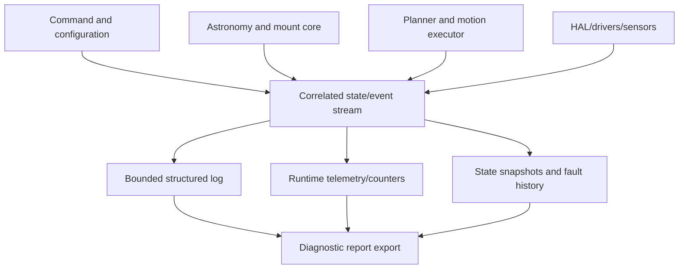

# Debugging and Diagnostics Specification

## 1. Objective and philosophy

Diagnostics answer: *what happened, where did it first diverge, and what evidence supports the conclusion?* They must distinguish requested behavior, calculated behavior, commanded motion, available hardware evidence, and estimated position. Logs alone are insufficient. This document realizes PRD FR-DIAG-001 and uses the error model in [ERROR_MANAGEMENT.md](ERROR_MANAGEMENT.md).

## 2. Observability architecture

Each operation receives a correlation ID. Measurements report their source, units, sample interval, validity, and dropped-sample count. Time-critical producers use bounded, non-blocking emission; a lower-priority consumer formats/exports data. Diagnostics never change motion behavior except through explicitly invoked test modes or safety faults.

## 3. Data to expose

| Category | Required evidence |
|---|---|
| Identity/startup | Firmware/build identity, hardware profile, configuration fingerprint, reset cause, enabled capabilities, startup/self-test results. |
| State snapshot | System/mount/subsystem health, active command, motion inhibition, position trust, time validity, alignment state. |
| Motion | Target and estimated axis position, direction, step rate, planned profile phase, queue depth, stop reason, timing min/max/summary and missed/deferred work counters. |
| Astronomy/mount | Input time/location validity, coordinate-frame identifiers, target/mount coordinates, transform/alignment result validity—not unbounded raw calculations. |
| Hardware | Driver enable/fault observations if available, configured driver mode, sensor readings/status and power observations if installed. |
| Communications | Link state, request/result/correlation, parse/validation failures, latency summaries, dropped/overflow counts. |
| Reliability | Watchdog feed/trigger context, reset history, memory/resource watermark, task/runtime statistics as platform permits. |
| History | Bounded events, warnings/faults, command history, configuration changes and recovery actions. |

## 4. Structured logging and levels

Levels are `TRACE` (temporary/high-volume), `DEBUG`, `INFO`, `WARNING`, `ERROR`, `FAULT`, and `CRITICAL`. Production defaults and retention budget are TBD; `TRACE` is disabled in critical timing paths. A log/event record contains `event_id` or error code, severity, sequence, timestamp, correlation ID, source, and key/value context. IDs follow the conventions in ERROR_MANAGEMENT; diagnostic events use `EVT-DIAG-NNN` and test events `EVT-TEST-NNN`.

## 5. Health, self-test, and modes

Startup self-test validates configuration integrity, reset cause recording, required interface initialization, driver-safe disabled state, and enabled sensor/driver feedback where present. It does not assert physical motor performance without an explicitly selected hardware test.

Modes are mutually controlled by safety policy: `NORMAL`, `VERBOSE_DIAGNOSTIC`, `SIMULATION`, `MOTION_DRY_RUN`, `AXIS_HARDWARE_TEST`, `COMMUNICATION_TEST`, and `SAFE_MAINTENANCE`. Test entry records operator intent and prerequisites; it is rejected while incompatible motion is active. Hardware test modes use conservative, configurable limits and are unavailable on unresolved safety faults.

## 6. Systematic debugging workflow

1. Reproduce safely and capture the correlation ID, configuration fingerprint, and observed symptom.
2. Classify as power/wiring, driver/motor, mechanical, timing, configuration, command/comms, mount/astronomy, alignment, environmental, or unknown.
3. Inspect current snapshot and active fault/event history; preserve a diagnostic report before resetting.
4. Compare requested target → calculated mount command → planned trajectory → issued motion/available feedback.
5. Isolate the hardware/software boundary with dry-run, simulation, or a limited axis test.
6. Select a hypothesis, run the smallest safe discriminating test, and capture expected versus actual evidence.
7. Record root cause, corrective action, and regression case. Add missing observation or test coverage where diagnosis was ambiguous.

## 7. Symptom decision procedures

| Symptom | First evidence | Discriminating tests / likely branches |
|---|---|---|
| Motor does not move | Inhibition, active fault, driver enable, commanded steps | Validate config/driver power/wiring; dry-run proves planner; axis test isolates driver/motor. |
| Wrong direction | Axis direction config, command sign, physical observation | Safe short axis test; distinguish direction inversion from coordinate convention error. |
| Stalls or jerks | Rate/profile, timing stats, supply/driver observations, mechanics | Lower safe rate; inspect current/microstep config and binding; compare unloaded/loaded behavior. |
| RA tracking inaccurate | Time validity, rate inputs, mechanics config, drift trend | Simulate rate; verify time/coordinate convention; compare periodic vs monotonic drift. |
| DEC GoTo inaccurate / overshoots / undershoots | Target, transformed axis target, trajectory, backlash setting, position trust | Repeat bidirectionally; distinguish conversion/config error, backlash, missed steps, or limit intervention. |
| Telescope gradually drifts | Tracking state, time source, alignment/reference, environmental notes | Correlate drift with elapsed time, direction, load, temperature and periodicity. |
| Communication fails | Link state, parse errors, request history, resource counters | Loopback/protocol test; verify commands do not block motion. |
| Resets or unresponsive | Reset cause, watchdog context, resource watermark, recent events | Preserve report; reproduce under controlled load; isolate power/reset from software timeout. |
| Position/alignment incorrect | Position trust, reference method, transform validity, configuration | Use simulation/dry-run and known references before physical movement. |
| Tracking later fails | Event timeline, temperature/power, queue/timing trends, watchdog | Compare startup and failure snapshots; test for cumulative resource or thermal/mechanical condition. |

For every case collect: firmware/build identity; hardware/configuration snapshot; timestamp and environment; exact command; expected/observed motion; state/fault/event history; relevant telemetry window; photos/wiring evidence when applicable; and repeatability conditions.

## 8. Diagnostic report concept (future export)

A shareable report SHOULD contain: report/version ID; firmware/build and hardware revision; sanitized configuration; reset reason; capabilities; active and historical faults; recent events and commands; state snapshot; motor/tracking/timing/communication statistics; sensor/power data if present; operator symptom and reproduction notes. It MUST flag unavailable evidence rather than fabricate it, and SHOULD omit credentials/network secrets. Export format and storage transport are TBD.

## 9. Test and coverage rules

Unit tests validate record schema, error classification, configuration validation, coordinate math, and planning independently. Integration tests verify event propagation and command-to-planner behavior. Simulation provides deterministic known cases. Hardware-in-the-loop tests measure timing, stop, driver behavior, and physical axis results using approved equipment. Locations and dependency rules are in [PROJECT_STRUCTURE.md](PROJECT_STRUCTURE.md). A diagnostic gap discovered in field debugging is a regression requirement, not merely a support note.
