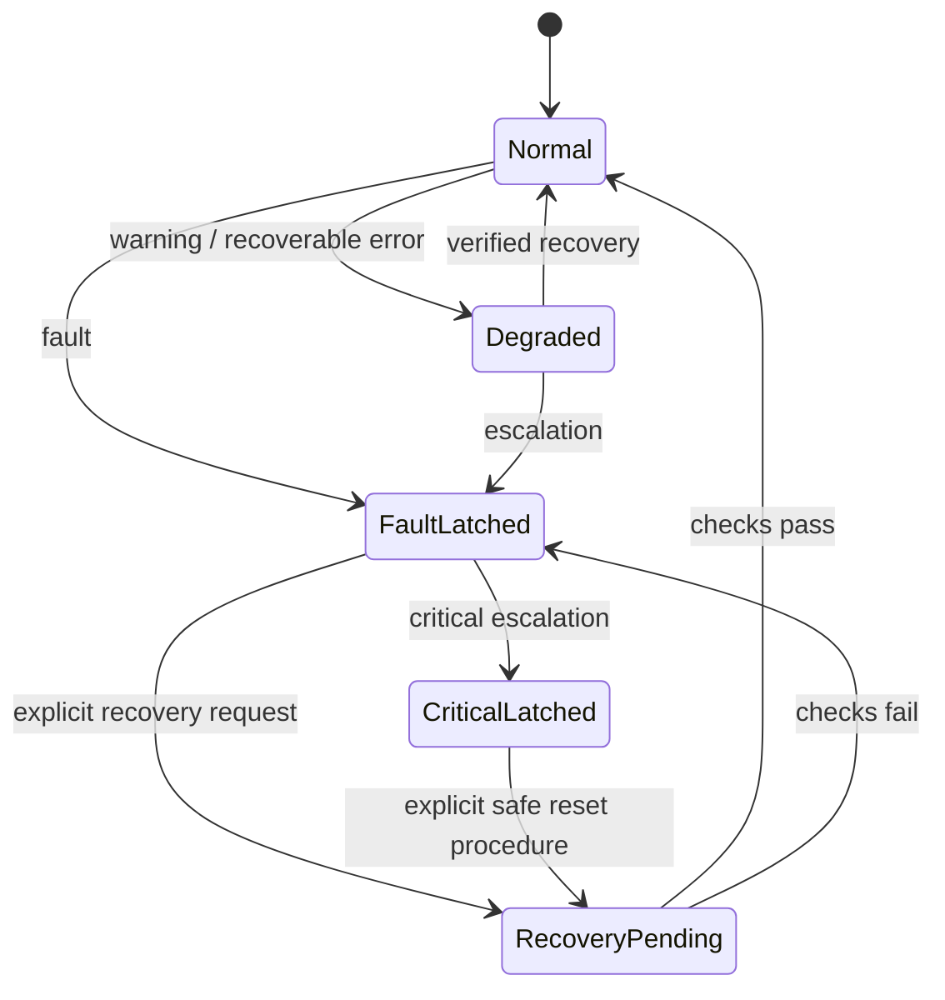
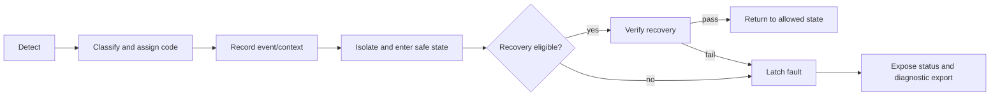

# Error Management Architecture

## 1. Purpose and philosophy

Errors are first-class domain data: detected early, classified consistently, recorded with context, isolated to the smallest safe scope, and made diagnosable. Safety takes priority over availability; the system never conceals an uncertain position or silently retries motion that could be unsafe. This architecture implements PRD requirements SAFE-001 through SAFE-004, FR-SAFE-001, and NFR-REL-001.

## 2. Terms and severity

| Term | Meaning | Motion effect |
|---|---|---|
| Diagnostic observation | Measured fact or anomaly, not a conclusion. | None by itself. |
| Event | Significant state transition or operation record. | Informational. |
| Warning | Degraded or suspicious condition within policy. | Continue, monitor, or restrict as defined. |
| Recoverable error | Operation failed but safe recovery is defined. | Affected operation stops/rejects. |
| Fault | Integrity or safety condition requiring intervention or reinitialization. | Inhibit affected subsystem; may latch. |
| Critical fault | Credible immediate hazard or loss of safe control. | Emergency motion inhibition; latch. |

Severity is independent of source. A warning may later escalate. Every record has one primary severity, source subsystem, code, correlation ID, monotonic timestamp, wall-clock time if valid, and structured context.

## 3. Error model and states

Subsystem health is `UNINITIALIZED`, `SELF_TEST`, `READY`, `ACTIVE`, `DEGRADED`, `FAULTED`, or `DISABLED`. System operation is `STARTUP`, `IDLE`, `TRACKING`, `SLEWING`, `PARKING`, `STOPPING`, `INHIBITED`, or `FAULTED`. A subsystem fault does not automatically fault the whole system unless its dependency or safety policy requires it.

## 4. Code convention and taxonomy

Codes use `SEVERITY-SOURCE-NNN`, e.g., `FLT-MOTION-001`; events use `EVT-SOURCE-NNN`. Numbers are stable, never reused, and documented with condition, context fields, response, recovery, and test. Sources: `CONFIG`, `STARTUP`, `POWER`, `DRIVER`, `MOTION`, `SENSOR`, `ASTRO`, `TIME`, `COMMAND`, `COMMS`, `RESOURCE`, `WATCHDOG`, `SAFETY`.

| Example code | Trigger | Default response |
|---|---|---|
| FLT-CONFIG-001 | Required configuration absent/invalid | Inhibit all motion until corrected. |
| FLT-STARTUP-001 | Required self-test fails | Keep affected hardware disabled. |
| FLT-DRIVER-001 | Driver fault signal if wired/available | Stop affected axis; mark position trust per policy. |
| FLT-MOTION-001 | Planner/executor contract violation | Controlled stop or emergency stop as assessed. |
| FLT-SAFETY-001 | Soft-limit violation or unsafe state | Stop/reject; latch if continued motion is credible. |
| FLT-ASTRO-001 | Invalid/undefined astronomical calculation | Reject operation; do not command motion. |
| ERR-TIME-001 | Time missing/invalid for time-dependent operation | Reject tracking/GoTo as policy requires. |
| ERR-COMMAND-001 | Invalid, malformed, or unauthorized command | No state change; structured response. |
| WRN-COMMS-001 | Link degraded or command timeout | Continue only if safe; record. |
| FLT-RESOURCE-001 | Required resource exhausted | Stop affected work; retain minimal fault record. |
| FLT-WATCHDOG-001 | Watchdog recovery detected on next boot | Inhibit motion pending startup validation. |

Exact codes grow only through a reviewed error catalog. Missing optional sensors are a configured capability state, not an error.

## 5. Handling pipeline

Detection must be non-blocking in timing-critical contexts: emit a bounded in-memory record or counter and defer expensive formatting/persistence. The safety controller is authoritative for step enable/inhibition. Fault propagation travels upward as typed status/events; lower layers do not decide astronomy policy, and higher layers do not write driver registers directly.

## 6. Recovery, retries, shutdown, and persistence

- Retry only idempotent, non-motion actions (for example a transient command transport operation), with count/backoff **TBD**. Never automatically retry a motion after uncertain physical execution.
- A controlled stop completes a deceleration profile when safe. Emergency stop disables new steps as promptly as hardware/design permits, cancels commands, records `EVT-SAFETY-*`, and latches if required.
- A position estimate becomes `UNTRUSTED` after a reset during motion, emergency stop, detected driver fault, or any event policy says may have lost steps. It may become trusted only through an approved reference procedure.
- Persistent records include active/latching faults, reset cause, configuration identity, and a bounded recent-event summary as storage allows. Persistent state is advisory until integrity and compatibility checks pass.
- Safe shutdown stops/inhibits motion, records shutdown intent/result, and does not claim parked or position-trusted unless verified by the selected policy.

## 7. Startup and fault isolation

Startup sequence: establish reset cause; load/validate configuration; initialize safety control disabled; test enabled capabilities; restore only valid persistent diagnostics; expose readiness; allow motion only after required checks and position-reference prerequisites. Failed optional hardware is isolated and reported; failed required hardware blocks dependent operations.

## 8. Required event record and interfaces

Every reportable error/event SHOULD include: code, severity, source, timestamp(s), sequence number, command/session correlation, system and subsystem states, axis/motion snapshot if relevant, configuration fingerprint, position-trust state, recovery action, and compact cause/detail fields. Logs must be bounded and loss itself counted (`WRN-RESOURCE-*`). Diagnostic consumers are specified in [DEBUGGING_AND_DIAGNOSTICS.md](DEBUGGING_AND_DIAGNOSTICS.md); module ownership is specified in [PROJECT_STRUCTURE.md](PROJECT_STRUCTURE.md).

## 9. Future automated diagnostics

The stable record schema deliberately separates observations (e.g., step-rate jitter) from conclusions (e.g., suspected power issue). Future classification or health models may consume records but must label outputs **experimental/research**, preserve raw evidence, and must not override safety policy without a separately approved safety case.
