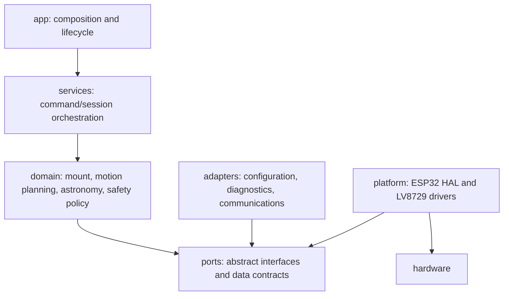

# Firmware Project Structure

## 1. Architectural intent

This is a proposed scalable ESP32 C/C++ layout for the firmware specified in [PRD.md](PRD.md). It establishes ownership and dependency direction, while board framework, build system, and exact interfaces remain TBD. It creates no source code in this documentation stage.



`domain` owns decisions and is portable; adapters/platform implement its ports. This allows adapters to submit validated requests into services without commanding hardware directly.

## 2. Proposed directory tree

```text
.
├── app/                    # Composition root, lifecycle, operating-mode assembly
├── core/                   # Shared types, result/status, time abstractions, bounded utilities
├── domain/
│   ├── astronomy/           # Coordinate/time calculations; no hardware knowledge
│   ├── mount/               # Mount state, tracking, GoTo, alignment/park policies
│   ├── motion/              # Kinematics, profiles, trajectories, axis execution contracts
│   └── safety/              # Safety policy, inhibition and recovery decisions
├── ports/                  # Interfaces for clock, motion execution, storage, telemetry, comms
├── adapters/
│   ├── configuration/       # Schema, validation, migration, persistence adapter
│   ├── communications/      # Serial now; Wi-Fi/protocol adapters later
│   └── diagnostics/         # Structured records, export, counters, report assembly
├── platform/
│   ├── esp32/               # Board/profile-specific HAL, tasks, timers, reset/watchdog
│   └── drivers/lv8729/      # LV8729 STEP/DIR/enable/fault implementation only
├── services/                # Command dispatch, session orchestration, use-case coordination
├── tests/
│   ├── unit/                # Portable module tests
│   ├── integration/         # Ports/adapters and service flows with fakes
│   ├── simulation/          # Deterministic mount/motion scenarios
│   └── hil/                 # Hardware-in-the-loop plans, fixtures, result captures
├── docs/                    # Future supplementary docs; top-level four are project specifications
└── tools/                   # Non-firmware developer/report/simulation helpers, if approved
```

The initial repository contains only the four top-level specification files; this tree is an approved target layout, not a request to create empty directories.

## 3. Module responsibilities

| Module | Owns | Must not own |
|---|---|---|
| `app` | Composition, lifecycle, configured capability selection | Telescope math or GPIO behavior. |
| `services` | Validated use-case orchestration and correlation IDs | Step timing or driver register behavior. |
| `domain/astronomy` | Pure time/coordinate transforms and validity | Board, serial, persistence, GPIO. |
| `domain/mount` | Mount modes, GoTo/tracking policies, position trust | LV8729 specifics. |
| `domain/motion` | Trajectory/profile semantics and execution contracts | Command parsing or astronomy transforms. |
| `domain/safety` | Inhibition/recovery policy per error state | Hardware pin implementation. |
| `ports` | Stable dependency-inverted interfaces/data contracts | Concrete ESP32 dependencies. |
| `adapters` | Translation to/from config, comms, diagnostics | Safety-policy bypass. |
| `platform` | ESP32 timing/HAL and LV8729 electrical control | Coordinate/alignment logic. |

## 4. Dependency and layering rules

1. Dependencies point toward `core`, `domain`, and `ports`; concrete platform/adapters depend on abstractions, never the reverse.
2. `domain/astronomy` MAY depend only on portable `core` and its explicit domain types.
3. `platform/drivers/lv8729` MAY expose STEP/DIR capability through a port but MUST NOT import `domain/astronomy`, `domain/mount`, or communications.
4. Communication adapters submit requests to `services`; UI/protocol code MUST NOT call motion or GPIO APIs directly.
5. Diagnostics are cross-cutting through a narrow telemetry/event port. Producers do not depend on log formatting, storage, or transport.
6. Configuration is parsed/validated in its adapter, then supplied as immutable validated data to app/services/domain; modules MUST NOT read global configuration directly.
7. No circular dependencies, global mutable cross-module state, or static hardware singleton is permitted without a documented exception.

Forbidden examples: astronomy manipulating GPIO; driver code interpreting RA/DEC targets; command parser enabling a motor; logger persistence occurring in a step interrupt; safety policy hidden inside a serial handler.

## 5. Interfaces and implementation boundaries

Ports include, as applicable: monotonic/wall clock; motion executor; step-enable safety gate; driver feedback; configuration storage; event/telemetry sink; command transport; and optional sensor providers. A board profile binds pins, timer/timing choices, and enabled hardware only in `platform/esp32`. LV8729 ownership includes only electrical configuration/control and observed driver signals; motor/axis mechanics remain validated configuration consumed by motion/mount logic.

The motion executor provides a narrow real-time boundary. Its producer-facing contract contains only validated trajectory segments and safety stop controls. It publishes bounded execution observations to diagnostics. Network, serial formatting, flash persistence, and astronomy calculations stay outside it.

## 6. Naming and source organization

- Directories and files use lowercase `snake_case`; public types use `PascalCase`; functions/variables use `snake_case`; constants use `kPascalCase` or a project-selected documented convention (TBD).
- A module has a focused public header/interface and private implementation; headers avoid board/framework includes unless located under `platform`.
- Interfaces are named for capability (`motion_executor`, `event_sink`), implementations for technology (`esp32_timer_motion_executor`, `lv8729_driver`).
- Requirement, event, and error IDs are not renamed casually; source references preserve their stable identifiers.

## 7. Configuration, diagnostics, and tests

Configuration uses a versioned schema with defaults only where safe, validation before use, migration rules, and a configuration fingerprint. Required mechanics and safety envelope are not silently defaulted. Diagnostics adapters implement the event record, bounded history, snapshots, counters, and report specified in [DEBUGGING_AND_DIAGNOSTICS.md](DEBUGGING_AND_DIAGNOSTICS.md); error policy/types live in `domain/safety` and shared contracts per [ERROR_MANAGEMENT.md](ERROR_MANAGEMENT.md).

Tests mirror ownership: `unit` has pure astronomy, mount, motion, config-validation and error-policy tests; `integration` uses fake ports; `simulation` represents known mechanics/sensors/time; `hil` holds hardware setup instructions and measured artifacts, never assumed hardware values. Test names reference applicable requirement/error IDs when practical.

## 8. Documentation and future extensions

The four root documents are normative baseline specifications. Decision records, interface contracts, configuration schemas, test procedures, and HIL setup instructions belong under `docs/` once needed and must link back to requirement IDs. Future encoders, sensors, Wi-Fi, alternate boards, or research modules arrive as ports plus adapters/platform implementations; they do not alter astronomy ownership or grant direct hardware access to services. Experimental/research features are isolated behind an explicit capability flag and labeled accordingly.

## 9. Architecture review checklist

Before merging future modules, confirm: correct layer ownership; no forbidden dependency; error codes/events emitted through the shared model; safe motion behavior; unit-testability without ESP32; diagnostic evidence for failures; validated configuration; and traceability to PRD requirements.
